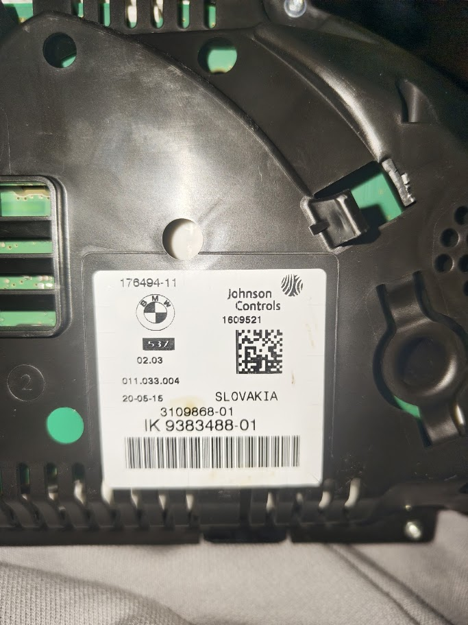

# CarCluster F10/F11 6WA

ESP32 firmware for running a BMW F10/F11 6WA diesel instrument cluster on a bench, from game telemetry, from a web dashboard, or as a Spotify/Voicemeeter audio VU display.

> [!IMPORTANT]
> This repository is a modified, BMW-focused fork of [r00li/CarCluster](https://github.com/r00li/CarCluster), originally created by [Andrej Rolih](https://www.r00li.com). A substantial part of the architecture and original cluster-control code comes from that project and its contributors. This fork adds tested F10/F11 behavior, reverse-engineered CAN experiments, diagnostics, enhanced telemetry, and the VU mode described below. It is not affiliated with or endorsed by BMW AG.

## Verified cluster

The maintainer personally uses and tests this firmware with the following cluster:

- BMW F10/F11 6WA diesel instrument cluster
- Johnson Controls
- rear-label identifier `IK 9383488-01`
- secondary label number `3109868-01`
- software/hardware marking `011.033.004`
- production date shown on the label: `20-05-15`



This exact unit is the compatibility baseline. Other F10/F11 diesel 6WA clusters are expected to be close, but may differ by coding, firmware, scale, or installed options. F30/F31 and Mini F-series support exists in the original CarCluster codebase, but is **not claimed as tested by this fork**.

## What this fork changes

### F10/F11-only firmware target

- Removed the VW, BMW E-series, Mercedes, and other unrelated cluster implementations from the build.
- Initializes the non-Mini BMW F-series profile with a 6,000 RPM diesel scale.
- Keeps the original CarCluster ESP32 + MCP2515 architecture and its game integrations.

### Confirmed behavior and useful defaults

- Corrected F-series speed and 12-bit RPM handling, with fast RPM refresh and stable supporting frames.
- English, metric, and `l/100 km` configuration using the verified `0x291` payload. A known payload that switched this cluster to German is deliberately not used.
- CAN-based fuel-level control; no X9C10X digital potentiometer is required for this target.
- Working gear, lighting, indicators, parking brake, backlight, temperature, drive-mode, and check-control paths inherited from and extended beyond upstream CarCluster.
- The `0x2C3` SOS/status candidate and `0x368` RDC status candidate are enabled as tested defaults for this bench setup.

### Clock/date work and Reset Clock warning suppression

**Clock setting does not work on the verified cluster.** The ESP32 can obtain local time from NTP, with the firmware build time as a fallback, and the repository still contains experimental CAN/UDS clock research code. None of the tested CAN broadcasts or UDS write attempts successfully set the clock on this Johnson Controls 6WA unit. Runtime date/time broadcasts were therefore removed from the normal update loop; the remaining controls and functions are research code only.

The yellow warning seen on this cluster was identified as check-control **CC-ID 167: Reset Clock**. The firmware repeatedly transmits the matching clear state on `0x5C0`, which suppresses the warning on the verified cluster.

This is only a workaround: it repeatedly clears the notification, but it does **not** set or reset the cluster clock. The displayed time can remain unset or incorrect. The current evidence suggests that this cluster expects its working clock source from the head unit over MOST rather than from the tested K-CAN frames. Experimental `0x39E`, `0x3F1`, UDS ReadDID/WriteDID, session, SecurityAccess seed, and RTC probes remain in the project for further research and must not be interpreted as a working time-setting feature.

### BMW diagnostics and experimental controls

- Read-only VIN query through the responsive BMW F-series UDS endpoint.
- ISO-TP multi-frame response assembly.
- ReadDID candidate scans and downloadable in-memory logs.
- Experimental RTC reads/writes, diagnostic-session tests, SecurityAccess seed requests, and routine scans.
- Dedicated controls for lane/KAFAS frames, RDC/TPMS candidates, raw source-frame reproduction, CC-ID tests, and a smooth full needle sweep.

Unsafe or unconfirmed operations are not silently enabled. Experimental controls are grouped under `/bmw-f-controls` and `/test`, and the page labels distinguish working defaults from candidates that had no effect.

### BeamNG improvements

Normal BeamNG OutGauge telemetry remains supported. The parser also accepts the extended `CCB1` packet format used during development for:

- ignition level and drive mode;
- low/high beam and individual indicators;
- individual door, bonnet, and boot states;
- tire warnings;
- oil, battery, and engine-overheat warnings;
- fuel volume, fuel flow, and calculated consumption;
- cruise-control state and set speed.

The extended sender is optional; standard OutGauge remains the fallback. The ready-to-install mod and its complete instructions are under [`beamng_protocols/`](beamng_protocols/README.md).

### Spotify / Voicemeeter VU needles

The `/test/vu` page analyses a stereo recording input locally in the browser:

- left channel drives the speedometer;
- right channel drives the tachometer;
- Beat mode emphasizes approximately 35-180 Hz;
- transient peak detection catches very short bass hits;
- sensitivity, attack, release, needle peak hold, channel linking, and channel swapping are adjustable;
- peak hold keeps a short target high long enough for the cluster's physical needle motors to react; the known CAN frames do not provide a motor-speed setting;
- a `0 ms` release setting provides an immediate software drop to the current audio level;
- audio-driven cluster updates continue while this tab is in the background or Chrome is minimized, as long as the VU tab and browser remain open;
- full-range stereo master volume drives the experimental consumption scale linearly: 0% = 0, 50% = 10, and 100% = 20 l/100 km;
- Stop restores the speed, RPM, ignition, and consumption-data state from before the test.

The RPM target frame is already sent every 10 ms and the speed target frame every 20 ms. Short-peak compensation therefore happens in the audio detector and target hold rather than by claiming to reprogram the cluster's internal stepper-motor speed. The consumption indicator uses the existing experimental `0x2BB`/`0x2C4` economy calculation and may retain some filtering inside the cluster.

No Spotify account data or song metadata is read, and audio is not uploaded to the ESP32 or anywhere else.

### License-compatible web server

The upstream Mongoose-generated web stack was removed from this fork. The dashboard now uses the LGPL-2.1-or-later `WebServer` library included with the Arduino core for ESP32. This removes the GPLv2-only/GPLv3 combination that would otherwise make redistribution of the linked firmware legally unclear.

The replacement preserves these routes:

| Route | Purpose |
| --- | --- |
| `/` | Main white/blue cluster dashboard |
| `/api/state` | JSON state API used by the dashboard and VU mode |
| `/bmw-f-controls` | BMW F-series settings and UDS tools |
| `/bmw-f-uds-log.txt` | Download the current UDS sweep log |
| `/test` | Experimental CAN and check-control tests |
| `/test/vu` | Spotify/Voicemeeter stereo VU mode |

## Hardware

- ESP32 DevKit-style board
- MCP2515 CAN module with an 8 MHz crystal
- regulated 12 V power supply, 1 A or more recommended
- compatible BMW F10/F11 6WA diesel cluster
- wiring suitable for 12 V power, ground, CAN-H, and CAN-L

Wiring documentation retained from upstream:

- [CarCluster PCB](PCB/README.md)
- [jumper-wire setup](Misc/README_WIRING_JUMPERS.md)
- [BMW F-series cluster wiring](Misc/README_WIRING_BMW_F.md)

> [!CAUTION]
> This is bench firmware for hobby and simulation use. Automotive electronics can be damaged by incorrect voltage, polarity, grounding, CAN wiring, or termination. Do not use this project to interfere with a road vehicle's safety systems.

## Build and upload

### Arduino IDE / Arduino CLI

The current tree is verified with:

- Arduino core for ESP32 `3.3.8`
- board target `esp32:esp32:esp32`

All non-platform libraries needed by the sketch are bundled under `CarCluster/src/Libs`.

Open `CarCluster/CarCluster.ino` in Arduino IDE, select a generic ESP32 Dev Module, review the `BEGIN USER CONFIGURATION` section, and upload. From the repository root, the equivalent CLI build is:

```powershell
arduino-cli compile --fqbn esp32:esp32:esp32 CarCluster
```

The tested build uses approximately 87% of the default 1,310,720-byte application partition and 25% of dynamic memory.

### PlatformIO

`platformio.ini` contains an `esp32dev` environment:

```powershell
pio run
```

## Wi-Fi and web dashboard

On first boot, WiFiManager creates an access point named `CarCluster` with password `carcluster`. Connect to it and select the Wi-Fi network the ESP32 should use. The configuration portal times out after three minutes; serial/SimHub operation remains available without Wi-Fi.

After connection, read the ESP32 IP address from the Serial Monitor and open:

```text
http://<esp32-ip>/
```

## Using Spotify and Voicemeeter

1. Route Spotify to `VoiceMeeter Input` or `VoiceMeeter AUX Input` in Windows.
2. Enable `A1` on that Voicemeeter strip so the music remains audible.
3. Enable the matching `B1`/`B2` virtual output.
4. Open `http://<esp32-ip>/test/vu`.
5. Allow audio-input access and select the corresponding VoiceMeeter Output recording device.
6. Start VU mode.

Browsers normally require HTTPS for microphone and virtual-input capture. Because the ESP32 dashboard is intentionally HTTP-only, Chrome testing requires the exact ESP32 origin to be added under `chrome://flags/#unsafely-treat-insecure-origin-as-secure`; Edge exposes the equivalent setting under `edge://flags`. Use this only for the trusted local ESP32 address.

## Game telemetry

### Forza Horizon 4/5

Enable Data Out and set the destination to the ESP32 IP address and UDP port `1101`.

### BeamNG.drive

For basic speed/RPM telemetry, enable OutGauge under the game's protocol settings and set the destination to the ESP32 IP address and UDP port `1102`.

For the full `CCB1` telemetry used by this fork, download [`carcluster_bmw_protocol.zip`](beamng_protocols/carcluster_bmw_protocol.zip), copy the ZIP unchanged into the BeamNG user folder's `mods` directory, reload the vehicle, and enable the custom/other protocols option. See the [BeamNG protocol installation guide](beamng_protocols/README.md) for the exact path, purpose, configuration, fallback behavior, and troubleshooting notes.

### SimHub

SimHub is supported over USB serial. Enable its Custom Serial Devices plugin and use the JSON update format documented by the [upstream CarCluster project](https://github.com/r00li/CarCluster#use-with-simhub).

## Project history and attribution

This is not a clean-room implementation. It is a derivative work built on CarCluster and retains the original source headers and attribution. The public repository starts from a clean release snapshot so that removed, license-incompatible generated web-server files are not redistributed in its commit history.

Primary upstream credit belongs to:

- [Andrej Rolih / r00li](https://github.com/r00li), creator of CarCluster;
- the [CarCluster contributors](https://github.com/r00li/CarCluster/graphs/contributors);
- the people credited in the [upstream acknowledgements](https://github.com/r00li/CarCluster#acknowledgements).

The F10/F11-specific modifications, tests, reverse-engineering notes incorporated into the firmware, replacement web dashboard, and Spotify/Voicemeeter VU mode were developed and tested by WesVoj in 2026.

## Licenses

The combined project is distributed under the **GNU General Public License version 3**. See [LICENSE](LICENSE).

You may copy, modify, and redistribute it under GPLv3, but you must preserve the license and notices, make the corresponding source available when distributing firmware binaries, and mark modified versions appropriately. Copyright in the original CarCluster portions remains with their respective authors; WesVoj owns only the new modifications and project-specific media contributed here.

Bundled library notices and compatible licenses are documented in [THIRD_PARTY_NOTICES.md](THIRD_PARTY_NOTICES.md), [README_LIBS.md](README_LIBS.md), and `LICENSES/`.
